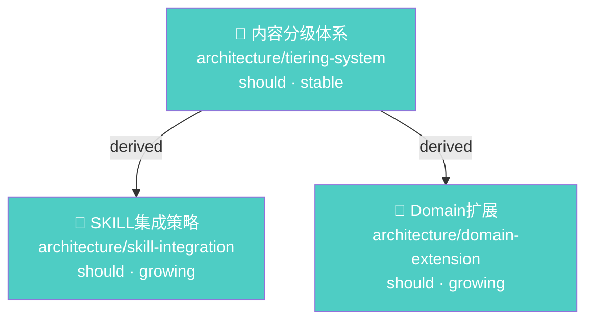

# Library Graph 实现方案深入分析

## 图模型定义

### 节点（Node）

每个 library 文档是一个节点：
```javascript
{
  id: "architecture/library-init-mechanism",  // 相对路径，唯一标识
  path: "ff-wiki/library/architecture/library-init-mechanism.md",
  title: "Library 首次初始化机制设计分析",
  doc_type: "architecture",
  importance: "should",
  maturity: "growing",
  topics: ["library", "initialization", "seed-docs"],
  size: 4521,         // 文件大小（字节），用于可视化节点大小
}
```

### 边（Edge）

三种来源：

| 边类型 | 来源 | 方向 | 权重 |
|--------|------|------|------|
| **explicit-ref** | `related.ref` 字段 | 源 → 目标 | 1.0 |
| **topic-overlap** | `topics` 标签交集 | 双向 | Jaccard 相似度 |
| **covers** | `covers` 字段 | 文档 → 源文件 | 0.5 |

```javascript
{
  source: "conventions/proposal-discovery-by-directory",
  target: "decisions/proposal-lifecycle-by-directory",
  type: "explicit-ref",     // explicit-ref | topic-overlap | covers
  weight: 1.0,
  role: "derived",          // related.ref 的 role 字段
}
```

### 相关 frontmatter 字段回顾

```yaml
# 现有字段
related:
  - ref: "../decisions/proposal-lifecycle-by-directory.md"
    role: source               # source | derived | reference

topics:
  - "library"
  - "initialization"

# 新增字段（可选）
covers:
  - "src/cli/scripts/validate-doc.js"
```

## 构建流程

```
1. 扫描 ff-wiki/library/**/*.md
      ↓
2. 对每个文件:
   a. 读取 frontmatter (title, doc_type, importance, maturity, topics, related, covers)
   b. 创建 Node
      ↓
3. 构建边:
   a. related.ref → explicit-ref 边（解析相对路径为绝对路径）
   b. topics 交集 → topic-overlap 边（可选，数据量大时关闭）
   c. covers → covers 边
      ↓
4. 构建邻接表（入度 + 出度）
      ↓
5. 缓存 graph.json（避免重复解析）
```

## CLI 命令接口

### 基础查询

```bash
# 查看某文档的直接关系
flowforge library graph backlinks <path>
# 输出: 谁引用了这个文档（入度）

flowforge library graph refs <path>
# 输出: 这个文档引用了谁（出度）

# 影响范围分析
flowforge library graph blast-radius <path> [--depth 2]
# 输出: 修改这个文档会影响哪些文档（BFS N 层）
```

### 路径查询

```bash
# 查找两个文档之间的最短连接
flowforge library graph path <path-a> <path-b>
# 输出: A → X → Y → B 的最短路径

# 查找某文档到所有 must 级文档的连接
flowforge library graph reach <path> --to importance=must
```

### 全局分析

```bash
# 孤立文档
flowforge library graph orphans
# 输出: 入度为 0 的文档列表

# 枢纽文档（被引用最多的）
flowforge library graph hubs [--top 10]
# 输出: 入度最高的文档

# 社区发现
flowforge library graph communities [--min-size 3]
# 输出: 按连接密度自动分组的文档簇

# 桥接文档（连接不同社区的）
flowforge library graph bridges
# 输出: 连接不同社区的文档
```

### 可视化输出

```bash
# Mermaid 图
flowforge library graph visualize <path> --depth 1 --format mermaid
# 输出: 可直接嵌入 Markdown 的 Mermaid 代码

flowforge library graph visualize --all --format mermaid --filter importance=must
# 输出: 所有 must 级文档的关系图

# JSON 导出（供外部工具消费）
flowforge library graph export --format json
```

## 实现架构

```javascript
// src/cli/scripts/lib/graph.js

class LibraryGraph {
  constructor(projectRoot) {
    this.nodes = new Map();   // path → Node
    this.adjIn = new Map();   // path → [Edge]  (入边)
    this.adjOut = new Map();  // path → [Edge]  (出边)
  }

  // 构建
  async build(options = {}) {
    const files = glob('ff-wiki/library/**/*.md');
    for (const file of files) {
      const fm = extractFrontmatter(file);
      this.addNode(file, fm);
    }
    for (const [path, node] of this.nodes) {
      this.addExplicitEdges(node);
      if (options.includeTopicEdges) this.addTopicEdges(node);
      if (node.covers) this.addCoverEdges(node);
    }
  }

  // 查询
  getBacklinks(path) { return this.adjIn.get(path) || []; }
  getRefs(path) { return this.adjOut.get(path) || []; }
  getOrphans() { /* 入度为 0 的节点 */ }
  getHubs(n) { /* 按入度排序取前 n */ }
  blastRadius(path, depth) { /* BFS */ }
  shortestPath(a, b) { /* BFS */ }
  communities() { /* Louvain or label propagation */ }

  // 导出
  toMermaid(focusPath, depth) { /* Mermaid flowchart */ }
  toJSON() { /* { nodes: [...], edges: [...] } */ }
}
```

## Mermaid 可视化示例

```bash
$ flowforge library graph visualize architecture/library-tiering-system.md --depth 1 --format mermaid
```

输出：


节点颜色按 importance 着色，形状按 maturity 区分。

## 性能考量

| library 规模 | 节点数 | 边数（含 topic-overlap） | 构建时间 | 缓存策略 |
|-------------|--------|------------------------|---------|---------|
| 小 (<50) | <50 | <500 | <1s | 不需要 |
| 中 (50-200) | 50-200 | <5000 | 1-3s | 缓存 graph.json，文件 mtime 变更时重建 |
| 大 (>200) | >200 | >5000 | 3-10s | 必须缓存 + 增量更新 |

**缓存策略**：
```javascript
// library/.graph-cache.json
{
  "builtAt": "2026-06-07T05:00:00Z",
  "fileHashes": { "path": "sha256" },  // 文件内容 hash
  "graph": { "nodes": [...], "edges": [...] }
}

// 增量更新：
// 1. 扫描 library/ 文件 mtime
// 2. 对比 fileHashes → 找出变更文件
// 3. 只重建变更文件涉及的节点和边
// 4. 更新 graph.json
```

## 与前端 UI 的关系

当前 FlowForge 无前端 UI。graph 主要消费方：
1. **CLI 直接输出**：文本报告、Mermaid 代码块
2. **context 脚本消费**：`design-context` 加载 blast-radius 结果
3. **INDEX.md 增强**：在 INDEX.md 中嵌入 Mermaid 图（可选）
4. **外部工具**：JSON 导出 → 导入 Obsidian/Graphviz 等

## 实现优先级

| 优先级 | 功能 | 成本 |
|--------|------|------|
| P0 | 基础图构建 + backlinks/refs | 低 |
| P0 | orphans 检测 | 低（基于入度） |
| P0 | Mermaid 导出 | 低 |
| P1 | blast-radius (BFS) | 低 |
| P1 | hubs/bridges | 低 |
| P1 | shortestPath | 低 |
| P2 | topic-overlap 边 | 中（计算量大） |
| P2 | communities | 中（需图算法） |
| P2 | 缓存 + 增量更新 | 中 |
