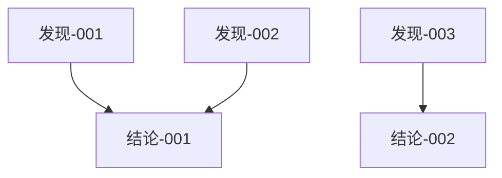

# MOC: {主题}探索

**创建日期**: YYYY-MM-DD
**最后更新**: YYYY-MM-DD

---

## 概述

<!-- 探索主题的整体概述 -->

---

## 关键问题

<!-- 探索过程中需要回答的关键问题 -->

1. 问题 1
2. 问题 2

---

## 发现地图

```mermaid
mindmap
  root(({主题}))
    发现-001
      子发现 A
      子发现 B
    发现-002
      子发现 C
```

---

## 结论地图



---

## 相关笔记

- [[发现-001-{name}]]
- [[发现-002-{name}]]
- [[结论-001-{name}]]

---

## 外部参考

<!-- 相关的外部文档、文章、代码库等 -->

---

## 待办事项

- [ ] 待确认的问题
- [ ] 需要进一步探索的方向
